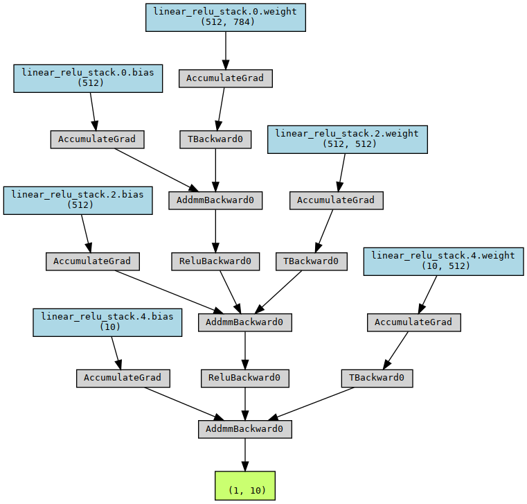

 # Pytorch template
 
 ## Ziang Chen

</br>
</br>


English Version   [简体中文版](README_cn.md)

</br>
</br>

This project aim to simpify the pytorch based development process. Porvide series useful tools about Data Loading, Training, Testing, Recording and Visualization. 


## Architecture 

* **data_loader**  </br>    -Data Processing and Data Stream
* **dataset**    </br>  -Training/Tesing/Validating Dataset
* **lib**       </br>  -Loss/Visulizaion and Other tools
* **model**     </br>   - model
* **trainer**   </br>    -training process  e.g. K cross validation
* **inter_data** </br>  -internal Data e.g. model dump during the training

## Quick Start

This Project contain with an straight forward example using MLP to train the classfication of MNIST

Start with cloning the package
```sh
git clone https://github.com/Ziang-Chen/torch-template.git
```
After unpack the code, switch to the root of the project
```sh
mkdir iner_data
mkdir dataset
```
Then put MNIST dataset on the dataset folder
Run python with
```sh
python train_mnist.py
```
This code also using torchviz to generat the compute graph


And the Neural Architecture Search
```py
import numpy as np

torchviz.make_dot(t.model(  torch.randn(1,784).to('cuda')  ),
                    params=dict(t.model.named_parameters())).render('./structure',format='png')


from autoPyTorch.api.tabular_classification import 

TabularClassificationTask

task=TabularClassificationTask()

x=train_x.data.detach().numpy().reshape(60000,784)
x=x[:,::8]
y=train_y.data.detach().numpy()
task.search( \
    optimize_metric='accuracy', \
    total_walltime_limit=300, \
    func_eval_time_limit_secs=50, \
    X_train=x ,\
    y_train=y ,\
    memory_limit=15000\

)
```
## API

/data_loader/dataloader.py

*  **DataLoader** </br>  Load Data from file path with loader function
*  **Stream** </br> create data stream from DataLoader with given batch size


## Next Steps

[X] Data Stream

[X] Model Visualization

[ ] Automatic Model Dump

[ ] Automatic Validation Set Seperate
