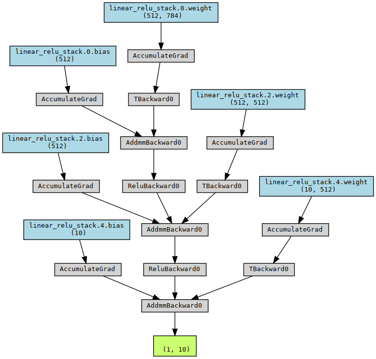

 ## Pytorch 模板

 ### Ziang Chen
</br>
</br>

简体中文版   [English Version](README.md)

</br>
</br>

这个项目旨在简化pytorch的使用流程，提供一系列包括数据加载，测试，训练，记录和可视化的工具集


### 目录结构

* **data_loader**  </br>    -数据预处理模块和数据流
* **dataset**    </br>  -数据集存放目录
* **lib**       </br>  -评价函数和可视化工具
* **model**     </br>   - 用于存放网络模型
* **trainer**   </br>    -训练器  如 K cross validation
* **inter_data** </br>  -内部数据 包括训练过程中的模型转储


## 快速入门

我写了一个用MLP训练MNIST分类器的模型用于快速入门

先clone下git
```sh
git clone https://github.com/Ziang-Chen/torch-template.git
```
然后解压并切换到项目的根目录并创建两个文件夹
```sh
mkdir iner_data
mkdir dataset
```
然后把mnist数据集放到Dataset下并运行python
```sh
python train_mnist.py
```
这个模型也可以用torchviz进行可视化


我也写了一段用于 Neural Architecture Search的代码
```py
import numpy as np

torchviz.make_dot(t.model(  torch.randn(1,784).to('cuda')  ),
                    params=dict(t.model.named_parameters())).render('./structure',format='png')


from autoPyTorch.api.tabular_classification import 

TabularClassificationTask

task=TabularClassificationTask()

x=train_x.data.detach().numpy().reshape(60000,784)
x=x[:,::8]
y=train_y.data.detach().numpy()
task.search( \
    optimize_metric='accuracy', \
    total_walltime_limit=300, \
    func_eval_time_limit_secs=50, \
    X_train=x ,\
    y_train=y ,\
    memory_limit=15000\

)
```
## API

/data_loader/dataloader.py

*  **DataLoader** </br>  加载数据，可以置顶加载器和文件路径
*  **Stream** </br> 用给定的 batch size创建数据流


## 下一步两步...

[X] 数据流

[X] 模型可视化

[ ] 自动模型转储

[ ] 自动分割Validation数据集